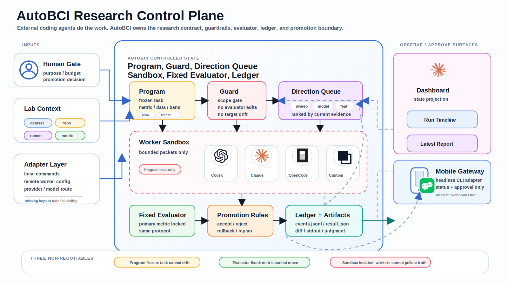
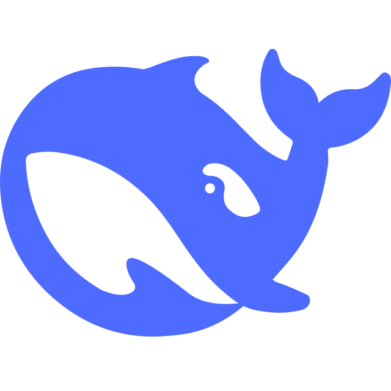
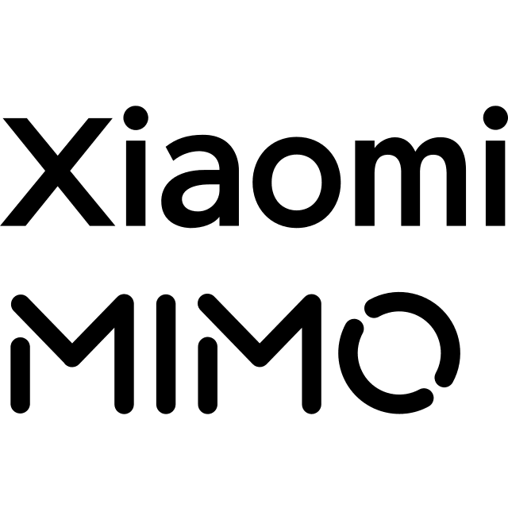

<h1 align="center">AutoBCI Harness</h1>

<p align="center">
  <b>你的 7×24 小时自动研究助手</b><br/>
  A perpetual AutoResearch harness for BCI algorithms: 人类冻结边界,本机持续实验,移动端观察与授权
</p>

<p align="center">
  
  
  
  
</p>

<p align="center">
  
</p>

---

## 核心特性

### 1. 7×24 小时的脑电算法自动研究助手

AutoBCI 把一次 BCI 算法迭代拆成可持续运行的研究循环:冻结任务边界,排队研究方向,让 agent 在受限沙盒里改代码、跑实验、复盘结果,再把证据压缩成下一轮可用的研究记忆。它的目标不是"问一次答一次",而是让本机算力在安全边界内持续推进自动研究。

适合它的问题不是简单脚本,而是这类长期科研压力:数据噪声大、个体差异强、跨 session 漂移明显、人工调参空间太大、单次高分又不可信。人类负责定义问题和批准关键边界,AutoBCI 负责把可尝试的方向一个个跑完。

### 2. 远程观察与受控授权

即使离开实验室,研究状态的真源也仍然留在本机 Program、ledger、events 和 artifacts 里。移动端网关只提供低摩擦的观察与授权入口:读取当前状态、记录论文线索、批准候选研究方向,或把关键进展发回来。

这不是远程桌面,也不是把手机消息变成任意 shell。AutoBCI 把长期实验留在本地可审计环境里运行,把必要的人类判断延伸到手机上。AutoBCI 是这套模式的第一个落点;同一套 Loop Engineering 方法也可以适配其它需要长期实验、固定评估和可审计试错的研究领域。

### 3. 支持主流模型供应商和 Agent 网关

AutoBCI 不把用户锁死在某一家模型或某一个 agent 网关上。模型层负责推理、计划和代码 worker;Agent/Gateway 层负责消息流转、远程观察和白名单控制。两层分开展示,不把 Claude 模型和 Claude Code 这类 coding agent 混成同一类。

<p align="center">
  <b>模型供应商</b><br/>
  
  &nbsp;&nbsp;
  
  &nbsp;&nbsp;
  
  &nbsp;&nbsp;
  
  &nbsp;&nbsp;
  
  &nbsp;&nbsp;
  
  &nbsp;&nbsp;
  
  &nbsp;&nbsp;
  
  &nbsp;&nbsp;
  
</p>

<p align="center">
  <b>Agent / Gateway</b><br/>
  
  &nbsp;&nbsp;&nbsp;&nbsp;
  
</p>

---

## 核心模块

### Guard:防止 AI 为了高分改题

Guard 是 AutoBCI 的边界检查层。它负责保护 Program、主指标、数据划分、原始数据和禁止事项,防止 agent 为了拿到更好看的分数而偷偷改题、换指标、碰 raw data,或把一次 lucky run 包装成算法突破。科研 loop 里最危险的不是失败,而是看起来成功但不可复现;Guard 就是专门拦这类假进步的。

### Trace + Ledger:让每一步都能回放

Trace 记录"发生了什么",Ledger 记录"为什么这一步可信或不可信"。一次 run 应该能追到命令、stdout/stderr、修改 diff、评估指标、artifact 路径、回滚线索和下一步理由。Dashboard 可以显示摘要,手机可以收到报告,但审计真源永远是本地 ledger、events 和 artifacts。

### State Compression:把长期试错压成可用研究记忆

长周期 AutoResearch 不能把所有历史对话、所有失败日志、所有中间思考都塞回模型。AutoBCI 的状态压缩机制会把多轮尝试沉淀成结构化研究记忆:哪些方向失败了,失败证据是什么,哪些假设还活着,下一轮该避开什么坑。它压缩的是研究状态,不是篡改事实。

### Storage Budget:别让自动研究撑爆电脑

自动研究最容易悄悄制造大文件:重复数据集、checkpoint、NumPy 数组、预测结果、event log。AutoBCI 默认不下载大数据,不复制原始数据,只保存本地路径指针;runner 应先检查 `AUTOBCI_MAX_DATASET_BYTES` 和 `AUTOBCI_MAX_ARTIFACT_BYTES`。`autobci storage audit --json` 是只读扫描,会报告重复文件和可压缩记录,不会替你删除数据。

### Provider Router:模型可换,失败必须可见

AutoBCI 把计划、判断、检索和代码 worker 的模型配置拆开。MiniMax、DeepSeek、GLM、Qwen、Kimi、OpenAI、Anthropic、MiMo 都可以作为不同 agent 的 provider。缺 key、模型不兼容或接口失败时必须显式失败;不能用本地 mock 冒充真实模型成功。

### Remote Gateway:手机是观察和授权入口

Hermes、OpenClaw、ClawBot、微信或 webhook 只应该做消息转发和白名单控制:查状态、发报告、记录论文链接、触发安全命令。它们不替代 AutoBCI 的本地状态机,也不应该拿到无限远程执行权限。科研真源仍在本机,手机只是让人类不必守在实验室电脑前。

### Dashboard:现场观察,不是第二套真相

Dashboard 负责显示当前 Program、研究队列、动态任务流、候选结果和 artifact 位置。它适合在实验室大屏或浏览器里看运行态,但不能覆盖 ledger。任何"完成了""变好了""跑出了结果"的说法,都必须能回到固定评估器和本地证据链。

---

## 为什么先从 BCI 开始

真实世界的大脑数据充满个体差异、跨 session 漂移和长尾异常。依靠人工穷举超参、反复对齐预处理、手动调试算法结构,既耗费心力,也无法覆盖组合空间。通用 coding agent 能写代码,但不天然理解科研边界:它可能改评价指标、改数据划分、吃未来信息,或在一次偶然高分后停止验证。

AutoBCI Harness 是为 BCI 等科研场景设计的 research-loop engineering harness(研究循环工程框架)。它的第一原则是:人类定义问题边界、主指标和禁止事项;AI 在边界内持续探索;每一步必须可追踪、可回滚、可审计。

---

## 🚀 快速开始(5 分钟跑通最小闭环)

**前置要求**:
- Python 3.10+
- Node.js 22+ 和 npm
- macOS 或 Linux(Windows 有检查脚本,但不是 alpha 首个验收目标)

```bash
git clone https://github.com/your-org/AutoBci-public-harness.git
cd AutoBci-public-harness
bash scripts/install.sh
source .venv/bin/activate

# 环境检查
autobci doctor --json

# 跑不依赖真实模型 key 的本地 demo(推荐首次验证)
autobci demo onsite --skip-smoke

# 打开 Dashboard
autobci dashboard
```

**`--skip-smoke` 会跳过真实模型调用,只验证本地闭环和 Dashboard。** 要跑真实 provider smoke,需要先配置 API key(见下节)。

---

## 🔑 配置模型(可选,仅用于真实 agent 驱动)

查看当前 provider 和模型状态:

```bash
autobci model list --json
```

配置 MiniMax 中国区 API key:

```bash
autobci model key minimax-cn
autobci model set --agent intake --provider minimax-cn --model MiniMax-M3
autobci model test minimax-cn --model MiniMax-M3 --json
```

运行带真实 intake smoke 的现场 demo:

```bash
autobci demo onsite --provider minimax-cn --model MiniMax-M3
```

常用 provider 已内置适配:

| Provider | 协议 | Key |
| --- | --- | --- |
| `minimax-cn` | Anthropic Messages 兼容 | `MINIMAX_CN_API_KEY` |
| `minimax` | Anthropic Messages 兼容 | `MINIMAX_API_KEY` |
| `deepseek` | OpenAI Chat Completions 兼容 | `DEEPSEEK_API_KEY` |
| `glm` / `zhipu` | OpenAI Chat Completions 兼容 | `ZAI_API_KEY` |
| `qwen` / `dashscope` | OpenAI Chat Completions 兼容 | `DASHSCOPE_API_KEY` |
| `xiaomi` / `mimo` | pi-ai runtime | `XIAOMI_API_KEY` |
| `openai` | pi-ai runtime | `OPENAI_API_KEY` |

**注意**: ChatGPT Plus 网页订阅 ≠ 本仓库 provider runtime 的 API key。Codex App 或 Codex CLI 可以用 ChatGPT 账号登录,但 AutoBCI 自己的 provider smoke、director web search 和内置 worker 需要相应 provider 的 API key。缺 key 或模型不可用时必须显式失败,不能用本地 mock 冒充成功。

---

## 📱 手机网关:远程观察与受控授权

AutoBCI 的默认产品入口是 **headless CLI + agent 对话**。它不要求用户打开 TUI,也不要求切到第三方窗口。Claude Code、Codex、Cursor、Workbody、Hermes、ClawBot 或其它 agent 只需要调用稳定命令:

```bash
autobci doctor --json
autobci status --json
autobci ask "现在进展如何？" --json
autobci-agent research-loop status --json
```

手机微信 / Hermes / OpenClaw 这类网关只负责传话和收报告。科研真源仍然在本机的 Program、ledger、events 和 artifacts 里。

配置教程见 [`docs/mobile_gateway_setup.md`](docs/mobile_gateway_setup.md)。

---

## 🎬 当前能跑什么

公开 alpha 故意保持窄路径,优先交付一条别人 clone 下来就能跑的最小闭环:

| 命令 | 用途 |
| --- | --- |
| `autobci` | 显示 headless CLI 入口和常用机器命令 |
| `autobci doctor --json` | 检查 Python、Node、provider 配置、Pi runtime、Dashboard 和 runner |
| `autobci status --json` | 读取当前 Program、研究循环、Dashboard 和 artifact 状态 |
| `autobci ask "现在进展如何？" --json` | 处理一次自然语言状态查询,默认不调用 live 模型 |
| `autobci data set /path/to/dataset` | 保存本地 BCI 数据目录或项目数据目录 |
| `autobci storage audit --json` | 非破坏性扫描本地记录目录,识别重复文件和可压缩记录 |
| `autobci demo onsite --skip-smoke` | 跑不依赖真实模型 key 的现场交付检查 |
| `autobci dashboard` | 打开本地 Dashboard,显示当前任务、动态任务流和审计面板 |
| `autobci-agent research-loop status` | 查看研究循环队列、ledger 和当前 phase |
| `autobci-agent director-plan --web on` | 使用 OpenAI web search 辅助生成研究方向(需配置 `OPENAI_API_KEY`) |

公开 alpha 不绑定某个具体公开任务。它先证明通用 BCI 研究闭环本身:Program、队列、runner、ledger、固定评估、Dashboard 和手机网关。真实课题需要用户在本地冻结自己的 Program,配置自己的数据目录、评估器和 runner。

主仓曾服务过 BCI/eCOG 严格因果解码研究;这个公开 harness 导出版只保留通用控制面和接入边界,不携带历史研究树、内部策略文档或真实科研数据。

---

## 🤝 社区与技术交流

开源本框架的初衷,是为了在更广泛、复杂的真实科研与临床场景中验证并打磨系统。

如果您所在的课题组或工程团队正面临以下挑战,欢迎交流:

1. **被海量异构脑数据的个体差异困扰,需要更系统的自动化调参和复盘机制**
2. **需要在不破坏现有私有代码库的前提下,低成本接入本地 Agent Loop**
3. **受限于校园网 / 医院内网,面临大模型 API 调用、隔离和本地跳板机部署难题**

我们希望了解真实使用场景中的约束、失败模式和接入边界,也欢迎围绕本地部署、数据管线、评估器和远程观察链路展开技术讨论。

**📫 联系方式:**
- **微信**: `[填入您的微信号]`
- **备注**: AutoBCI 技术交流

---

## 🔧 交给 Cursor / Codex / Claude Code

把这个仓库交给 coding agent 时,不要只说"帮我优化代码"。建议直接复制下面这段:

```text
Read README.md, AGENTS.md, DEMO_QUICKSTART.md, and docs/storage_budget.md.

Treat AutoBCI as a research-loop engineering harness, not as a generic coding task.
First run:

bash scripts/install.sh
source .venv/bin/activate
autobci doctor --json
autobci status --json
autobci ask "现在进展如何？" --json
autobci demo onsite --skip-smoke
autobci-agent research-loop status --json

Before proposing edits, report:
1. the current Program boundary;
2. the primary metric;
3. the allowed and forbidden files/actions;
4. the current research queue;
5. where ledger, events, and artifacts are written.

Do not modify data/raw, ProgramMD, data splits, primary metrics, or alignment logic unless I explicitly approve it.
```

如果要让 agent 搜论文或 GitHub 方向,先确认 provider key,再用:

```bash
autobci-agent director-plan \
  --web on \
  --web-provider openai_web_search \
  --min-tracks 10 \
  --json
```

---

## 📂 仓库结构

```text
.
├── README.md
├── DEMO_QUICKSTART.md
├── AGENTS.md              # 给 coding agent 的硬规则
├── pyproject.toml
├── src/bci_autoresearch/
├── scripts/
├── dashboard/
├── programs/
├── experiments/
├── configs/
├── tests/
└── .agents/skills/
```

**重要入口:**
- `AGENTS.md`:给 coding agent 的硬规则
- `DEMO_QUICKSTART.md`:最短现场演示路径
- `docs/storage_budget.md`:数据和产物的默认磁盘预算
- `programs/`:本地 Program 放置处；公开叙事不绑定具体任务
- `.agents/skills/autobci-harness/SKILL.md`:作为本地研究 harness 使用 AutoBCI
- `scripts/`:接入本地 runner、Dashboard 和安装脚本

---

## 🔬 Dashboard

Dashboard 是运行态投影,默认本地启动:

```bash
autobci dashboard
```

它会显示:
- 当前任务和 Program 摘要
- 动态任务流
- 分类指标或历史回归指标
- 研究队列和即将执行的 track
- ledger、events、artifacts 的位置
- 当前结果是否只是 smoke、候选,还是固定评估后的结果

**Dashboard 不是审计真源**。审计真源在这些文件里:

```text
artifacts/research_loop/<task_id>/events.jsonl
artifacts/research_loop/<task_id>/ledger.jsonl
artifacts/research_loop/<task_id>/runs/<run_id>/result.json
artifacts/monitor/demo_task_stream.json
```

---

## 🧪 本地数据目录

公开 harness 不规定某个固定数据 schema。真实 BCI 任务的数据布局应由冻结 Program、配置文件和本地 runner 明确声明。

本地路径只写入 `.autobci/data_paths.json`。这个文件被 Git 忽略,不会提交你的本机路径。

**磁盘安全边界:**
- 本仓库不会默认下载 Kaggle、BCI 原始数据或第三方数据集。
- runner 默认应拒绝超过预算的数据目录和 artifacts。
- 如确实需要更大数据,显式设置 `AUTOBCI_MAX_DATASET_BYTES=10G` 或 `AUTOBCI_MAX_ARTIFACT_BYTES=2G`。
- `kaggle/`、`artifacts/`、`data/`、`.autobci/` 和常见模型/数组产物都被 Git 忽略,不要把大产物放进公开提交。

详细策略见 [`docs/storage_budget.md`](docs/storage_budget.md)。

**原始科研数据边界:**
- `data/raw/` 永远只读
- 不允许为了拿高分修改原始数据、数据划分、主指标或标签定义
- 历史 BCI 训练代码必须保持严格因果:模型输入只能使用当前和过去样本,不能在预处理、归一化、平滑或目标构造中使用未来信息

---

## ⚙️ 开发检查

安装开发依赖:

```bash
AUTOBCI_INSTALL_DEV=1 bash scripts/install.sh
```

最小回归检查:

```bash
PYTHONPATH=src pytest -q tests/test_headless_cli.py
git diff --check
```

涉及 CLI、provider、Dashboard、runner 或 research-loop 的改动,至少跑对应单测和一个本地 smoke。**缺 key、缺 runner 或配置不兼容时必须显式失败,不能用本地兜底路径冒充成功**。

存储审计:

```bash
autobci storage audit --json
```

这条命令只读扫描 `artifacts/`、`output/`、`tmp/`、`.autobci/`,报告重复大文件和可压缩文本记录,不会删除、压缩或移动任何文件。

---

## ⚠️ 当前边界

- 公开 alpha 不附带真实业务数据
- 不承诺自主研究一定提升分数
- 不把单次最高分包装成可靠科研结论
- 不把内部 smoke fixture 包装成公开 BCI 成果
- 不允许 silent fake fallback
- 不允许 agent 自行改 Program、主指标、数据划分或 raw-data 边界

---

## 📄 License

Apache-2.0. See `LICENSE`.
