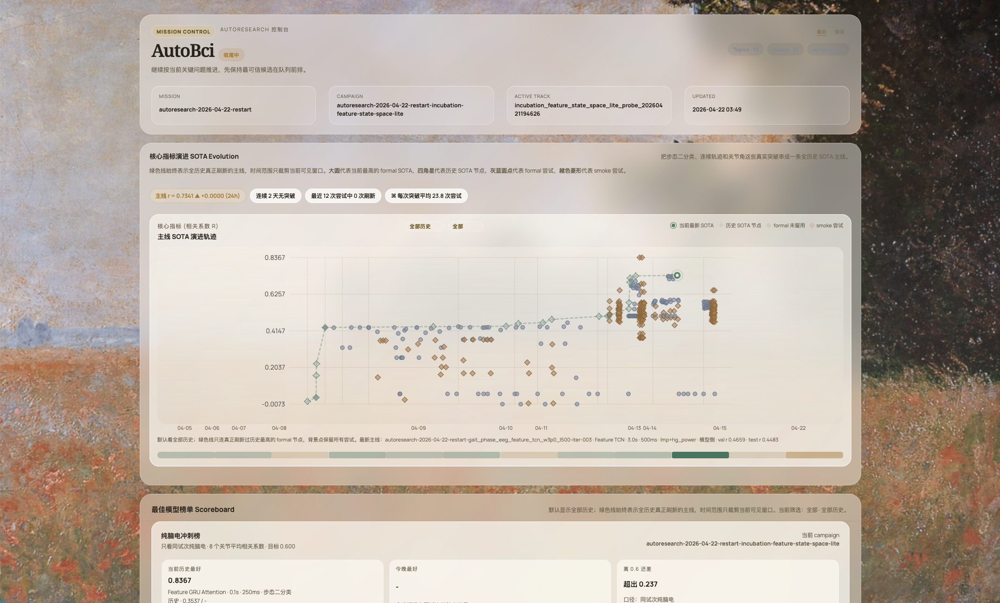

<h1 align="center">AutoBCI Harness</h1>

<p align="center">
  <b>Turn research into a search problem.</b><br/>
  Humans define the space · agents run the loop · every step is auditable.
</p>

<p align="center">
  
  
  
  
</p>

<p align="center">
  
</p>

AutoBCI 是一个本地、可审计的 AI 助力科研循环工程 harness，也就是 research-loop engineering harness。

它不是又一个通用聊天机器人，也不是把 Cursor、Codex 或 Claude Code 包一层 UI。AutoBCI 解决的是更长周期的科研问题：人负责定义问题、边界、指标和禁止事项，AI agent 负责在这个空间里持续提出方向、改代码、跑实验、回填结果；AutoBCI 负责把这个循环变成可追踪、可复盘、可暂停、可回滚的工程系统。

当前公开版本是 alpha。它的目标是先交付一条别人 clone 下来就能跑的最小闭环：安装、环境检查、模型配置、现场 demo、动态 Dashboard、研究队列状态和审计记录。

## 为什么需要 AutoBCI

单次代码生成已经很强，但科研不是单次代码生成。真正困难的地方通常在这些问题上：

- 研究目标是否被偷偷改了？
- 评价指标是不是固定的，还是 agent 为了拿高分临时换了指标？
- 新算法到底是结构突破、参数 sweep，还是碰巧一个数据划分好看？
- 跑了 10 次、50 次之后，哪些失败经验进入了下一轮判断？
- agent 是否改了不该改的文件，比如原始数据、数据划分、主指标或 Program？
- 人应该把精力放在调参细节上，还是放在定义问题空间和判断方向上？

AutoBCI 的判断是：人的主要工作应该从“手工调每个细节”转到“设计科研循环”。具体代码执行可以交给 coding agent，但循环本身必须由本地文件、固定评估器和审计记录控制。

## 核心循环

```text
Human Gate
  -> Program
  -> Direction Queue
  -> Worker Sandbox
  -> Fixed Evaluator
  -> Ledger / Artifacts
  -> Compression / Replan
  -> Dashboard
  -> Human Gate
```

这些词在本项目里的含义很具体：

| 模块 | 项目含义 |
| --- | --- |
| Human Gate | 人决定问题定义、边界、指标、是否允许改关键契约。 |
| Program | 冻结的任务说明，写清楚要预测什么、用什么数据、主指标是什么、哪些动作禁止。 |
| Direction Queue | 研究方向队列。每个 track 说明为什么做、怎么做、预计改哪些文件。 |
| Worker Sandbox | 受限执行区。可以接 Codex、Claude Code、OpenCode、自定义 runner 或内置 patch worker。 |
| Fixed Evaluator | 固定评估器。结果不能靠事后改指标包装成进步。 |
| Ledger / Artifacts | 审计真源，记录命令、diff、stdout/stderr、指标、产物路径和回滚线索。 |
| Compression / Replan | 多轮尝试后的中层压缩，把失败、证据和下一步方向重新整理给下一轮。 |
| Dashboard | 运行态投影，用来现场观察当前在做什么；不是第二套真相。 |

## 当前能跑什么

公开 alpha 故意保持窄路径：

- `autobci`：本地 TUI 主入口，用来配置模型、描述任务、查看状态和打开 Dashboard。
- `autobci doctor --json`：检查 Python、Node、provider 配置、Pi runtime、Dashboard 和 runner。
- `autobci demo onsite`：现场交付 demo，自动跑环境检查、控制面状态、Dashboard 和可选 provider smoke。
- `autobci dashboard --task rsvp`：打开本地 Dashboard，显示当前任务、动态任务流和审计面板。
- `autobci-agent research-loop status`：查看研究循环队列、ledger 和当前 phase。
- `autobci-agent director-plan --web on --web-provider openai_web_search`：在配置 `OPENAI_API_KEY` 后，让 director 使用 OpenAI web search 辅助生成研究方向。

当前第一屏 demo 任务是 `rsvp_ship_image_only_v0`：一个纯图像 ship / not-ship 二分类示例。它用来演示 Program、队列、runner、ledger 和 Dashboard 流程。它不是 BCI 结果，不能被描述成脑电解码结果。

主仓曾服务过 BCI/eCOG 严格因果解码研究；这个公开 harness 导出版只保留现场闭环所需代码和 RSVP 图像 demo，不携带历史研究树或内部策略文档。

## 快速开始

要求：

- Python 3.10+
- Node.js 和 npm
- macOS 或 Linux 是当前主路径；Windows 有检查脚本，但不是公开 alpha 的首个硬验收目标

```bash
git clone <clean-harness-repo-url>
cd AutoBci
bash scripts/install.sh
source .venv/bin/activate
autobci doctor --json
autobci demo onsite --skip-smoke
autobci dashboard --task rsvp
```

`--skip-smoke` 会跳过真实模型调用，只验证本地闭环和 Dashboard。要跑真实 provider smoke，需要先配置 API key。

## 配置模型

查看当前 provider 和模块模型：

```bash
autobci model list --json
```

配置 OpenAI API key：

```bash
autobci model key openai --api-key "$OPENAI_API_KEY"
autobci model set --agent intake --provider openai --model gpt-5.5
autobci model test openai --model gpt-5.5
```

运行带真实 intake smoke 的现场 demo：

```bash
autobci demo onsite --provider openai --model gpt-5.5
```

注意：ChatGPT Plus 网页订阅不等于本仓库 provider runtime 的 API key。Codex App 或 Codex CLI 可以用 ChatGPT 账号登录，但 AutoBCI 自己的 provider smoke、director web search 和内置 worker 需要相应 provider 的 API key。

## 交给 Cursor / Codex / Claude Code

把这个仓库交给 coding agent 时，不要只说“帮我优化代码”。建议直接复制下面这段：

```text
Read README.md, AGENTS.md, DEMO_QUICKSTART.md, and programs/rsvp_ship_image_only_v0/ProgramMD.md.

Treat AutoBCI as a research-loop engineering harness, not as a generic coding task.
First run:

bash scripts/install.sh
source .venv/bin/activate
autobci doctor --json
autobci demo onsite --skip-smoke
autobci-agent research-loop status --task rsvp_ship_image_only_v0 --json

Before proposing edits, report:
1. the current Program boundary;
2. the primary metric;
3. the allowed and forbidden files/actions;
4. the current research queue;
5. where ledger, events, and artifacts are written.

Do not modify data/raw, ProgramMD, data splits, primary metrics, or alignment logic unless I explicitly approve it.
```

如果要让 agent 搜论文或 GitHub 方向，先确认 provider key，再用：

```bash
autobci-agent director-plan \
  --web on \
  --web-provider openai_web_search \
  --min-tracks 10 \
  --json
```

如果没有 `OPENAI_API_KEY`，这个路径必须显式失败或降级为 disabled/fixture，不能假装完成真实 web research。

## 示例数据目录

公开 demo 的图像任务期望一个二分类目录：

```text
your_dataset/
  target/
  nontarget/
  allimages/    # optional: original mixed files
```

本地路径只写入 `.autobci/data_paths.json`。这个文件被 Git 忽略，不会提交你的本机路径。

原始科研数据边界：

- `data/raw/` 永远只读。
- 不允许为了拿高分修改原始数据、数据划分、主指标或标签定义。
- 历史 BCI 训练代码必须保持严格因果：模型输入只能使用当前和过去样本，不能在预处理、归一化、平滑或目标构造中使用未来信息。

## 常用命令

| 命令 | 用途 |
| --- | --- |
| `autobci` | 打开本地 TUI。 |
| `autobci doctor --json` | 检查本机运行环境。 |
| `autobci demo onsite --skip-smoke` | 跑不依赖真实模型 key 的现场交付检查。 |
| `autobci demo onsite --provider openai --model gpt-5.5` | 跑带真实 provider smoke 的现场 demo。 |
| `autobci dashboard --task rsvp` | 打开当前 RSVP 图像任务 Dashboard。 |
| `autobci status --json` | 查看当前控制面状态。 |
| `autobci model list --json` | 查看 provider、模块模型和 key 是否 ready。 |
| `autobci model key openai --api-key "$OPENAI_API_KEY"` | 保存 provider key 到本地 secrets 文件。 |
| `autobci smoke intake-llm --provider openai --model gpt-5.5 --json` | 单独测试自然语言到 Program 的 intake 路径。 |
| `autobci-agent research-loop status --json` | 查看研究循环队列和 ledger。 |
| `autobci-agent research-loop run --max-steps 1 --json` | 推进研究循环一步。 |
| `autobci-agent director-plan --web on --web-provider openai_web_search --json` | 使用 OpenAI web search 辅助生成研究方向。 |

## Dashboard

Dashboard 是运行态投影，默认本地启动：

```bash
autobci dashboard --task rsvp
```

它会显示：

- 当前任务和 Program 摘要
- 动态任务流
- 分类指标或历史回归指标
- 研究队列和即将执行的 track
- ledger、events、artifacts 的位置
- 当前结果是否只是 smoke、候选，还是固定评估后的结果

Dashboard 不是审计真源。审计真源在这些文件里：

```text
artifacts/research_loop/<task_id>/events.jsonl
artifacts/research_loop/<task_id>/ledger.jsonl
artifacts/research_loop/<task_id>/runs/<run_id>/result.json
artifacts/monitor/demo_task_stream.json
```

## 仓库结构

```text
.
├── README.md
├── DEMO_QUICKSTART.md
├── AGENTS.md
├── pyproject.toml
├── src/bci_autoresearch/
├── scripts/
├── dashboard/
├── programs/
│   └── rsvp_ship_image_only_v0/
├── experiments/
├── configs/
├── tests/
└── .agents/skills/
```

重要入口：

- `AGENTS.md`：给 coding agent 的硬规则。
- `DEMO_QUICKSTART.md`：最短现场演示路径。
- `programs/rsvp_ship_image_only_v0/ProgramMD.md`：当前公开 demo 的冻结 Program。
- `.agents/skills/autobci-harness/SKILL.md`：作为本地研究 harness 使用 AutoBCI。
- `scripts/run_rsvp_ship_image_autoresearch.py`：RSVP 纯图像任务的最小 runner。

## 开发检查

安装开发依赖：

```bash
AUTOBCI_INSTALL_DEV=1 bash scripts/install.sh
```

最小回归检查：

```bash
PYTHONPATH=src pytest -q tests/test_rsvp_ship_image_autoresearch.py
git diff --check
```

涉及 CLI、TUI、provider、Dashboard、runner 或 research-loop 的改动，至少跑对应单测和一个本地 smoke。缺 key、缺 runner 或配置不兼容时必须显式失败，不能用本地兜底路径冒充成功。

## 当前边界

- 公开 alpha 不附带真实业务数据。
- 不承诺自主研究一定提升分数。
- 不把单次最高分包装成可靠科研结论。
- 不把 RSVP 纯图像 demo 说成脑电结果。
- 不允许 silent fake fallback。
- 不允许 agent 自行改 Program、主指标、数据划分或 raw-data 边界。

## License

Apache-2.0. See `LICENSE`.
